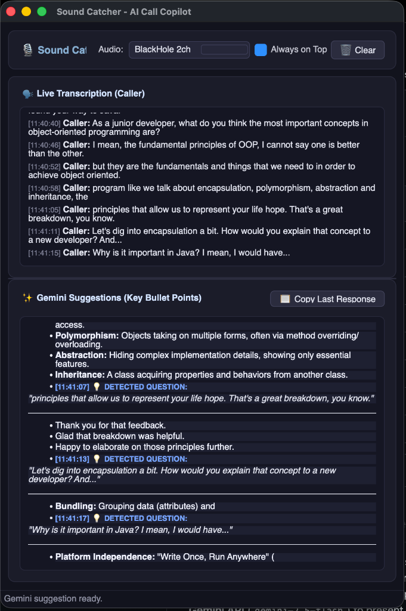

# 🎙️ Sound Catcher - Real-Time Call Copilot for macOS & Windows

**Sound Catcher** is an intelligent desktop assistant built with Python and PySide6 for **macOS** and **Windows**. It intercepts system output audio in real time during voice calls or video conferences (Zoom, Google Meet, Microsoft Teams, Slack, etc.), automatically transcribes the caller's speech, detects when they ask a question, and leverages the **Google Gemini API** (`gemini-2.5-flash`) to present clear, professional bullet-pointed answers in an **Always on Top** floating window.

<p align="center">
  
</p>

---

## 📋 System Requirements

- **Operating System:** macOS 12+ or Windows 10 / 11 (64-bit).
- **Python:** version 3.10 or higher.
- **Virtual Audio Device:**
  - **macOS:** BlackHole 2ch (to loop back caller system audio).
  - **Windows:** VB-Audio Virtual Cable (`VB-Cable`) or Stereo Mix.
- **Google Gemini API Key:** Obtainable at [Google AI Studio](https://aistudio.google.com/).

---

## 🎧 Step 1: Audio Setup

### macOS Setup (BlackHole 2ch)

1. **Install BlackHole 2ch via Homebrew:**
   ```bash
   brew install blackhole-2ch
   ```
2. **Configure Multi-Output Device:**
   - Open **Audio MIDI Setup** (`open -a "Audio MIDI Setup"`).
   - Click **`+`** -> **"Create Multi-Output Device"**.
   - Check both your Headphones/Speakers and **BlackHole 2ch**.
   - Set **System Sound Output** to **Multi-Output Device**.

### Windows Setup (VB-Audio Virtual Cable)

1. **Download & Install VB-CABLE:**
   - Download the free **VB-CABLE Driver** from [vb-audio.com/Cable](https://vb-audio.com/Cable/).
   - Extract the ZIP and right-click `VBCABLE_Setup_x64.exe` -> **Run as Administrator**. Restart your PC if prompted.
2. **Configure Windows Audio Routing:**
   - Open **Settings** -> **System** -> **Sound** -> **Control Panel / Sound Control Panel**.
   - In the **Playback** tab, right-click **CABLE Input** -> select **Properties** -> **Listen** tab -> check **"Listen to this device"** and set playback through your primary headphones/speakers.
   - Alternatively, set **CABLE Input** as your default output, or route your conference app (Zoom/Teams) speaker output to **CABLE Input**.
### Remote Cross-Platform Setup (Mac Call -> Windows App)

If you hold your calls on your **macOS laptop** but want to run **Sound Catcher** on a **Windows laptop**:
1. Run `python3 mac_audio_sender.py --ip <WINDOWS_IP>` on your Mac.
2. Select **`🌐 Network Stream (UDP Port 50005)`** in Sound Catcher on Windows.

👉 **See the complete step-by-step tutorial in [REMOTE_STREAMING_GUIDE.md](file:///Users/johan/Development/sound-catcher/REMOTE_STREAMING_GUIDE.md)**

---

## 🚀 Step 2: Application Setup

### 2.1 Navigate to Project Directory

```bash
cd sound-catcher
```

### 2.2 Create & Activate Python Virtual Environment

- **macOS / Linux:**
  ```bash
  python3 -m venv venv
  source venv/bin/activate
  ```
- **Windows (Command Prompt / PowerShell):**
  ```cmd
  python -m venv venv
  venv\Scripts\activate
  ```

### 2.3 Install Dependencies

```bash
pip install -r requirements.txt
```

---

## 🔑 Step 3: Configure Gemini API Key

Create a `.env` file in the root directory with your API key:

```env
GEMINI_API_KEY=your_actual_api_key_here
GEMINI_MODEL=gemini-2.5-flash
STT_MODEL_SIZE=base
```

*Note: You can also launch the app and click the **"🔑 Set API Key"** button on the top banner to paste your key directly through the GUI.*

---

## 🏃‍♂️ Step 4: Running the App

With the virtual environment activated, run:

```bash
python3 main.py
```

### Application Features:
1. In the **Audio** dropdown, select **BlackHole 2ch** (auto-selected if detected).
2. Speak or play call audio:
   - The top panel **🗣️ Live Transcription** displays real-time speech-to-text.
   - The bottom panel **✨ Gemini Suggestions** automatically generates bullet-pointed response notes when a question is detected.
3. Click **📋 Copy Last Response** to instantly copy answers to your clipboard.
4. The window floats on top of all applications for easy reading. Toggle **Always on Top** via the checkbox anytime.

---

## 🛠️ Project Structure

```
sound-catcher/
├── spec.md                # Technical specification
├── requirements.txt       # Python dependencies
├── config.py              # Global configuration & .env reader
├── main.py                # App entrypoint and Qt orchestrator
├── README.md              # Installation & setup guide
├── .env                   # Environment file for GEMINI_API_KEY
├── .env.example           # Environment template
└── src/
    ├── audio_capture.py   # Real-time audio stream worker (sounddevice + QThread)
    ├── transcriber.py     # Local Speech-To-Text worker (faster-whisper + VAD)
    ├── ai_assistant.py    # Google Gemini API integration (google-genai SDK)
    └── gui.py             # Modern PySide6 dark mode floating GUI
```

---

## ❓ Troubleshooting

### 1. Microphone / Audio Recording Permissions
If the audio meter shows no signal, ensure Terminal / Python has audio recording permissions under **System Settings** -> **Privacy & Security** -> **Microphone**.

### 2. Cannot Hear Call Audio
Verify that **Multi-Output Device** is selected in macOS Sound Settings, and that both your headphones/speakers and BlackHole 2ch are checked in Audio MIDI Setup.
